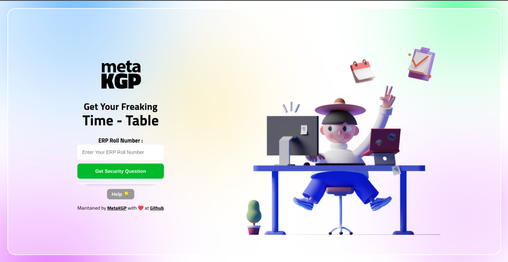

# FRONTEND
## GYFT - GET YOUR FREAKING TIME TABLE

This would download your `timetable.ics` file, import to Google Calendar by following this [link](https://support.google.com/calendar/answer/37118?hl=en).

### PREVIEW

### Running Locally

Please follow the following steps to run the application locally.

NOTE: The instructions assumes that you have [Node](https://nodejs.org/en) and [Yarn](https://yarnpkg.com/) installed on your system

0. Clone the repository `git clone https://github.com/metakgp/gyft`
1. Change directory to the `<path-to-cloned-repository>/frontend`.
2. Run `yarn install`
3. Run `yarn run dev` to start the development server